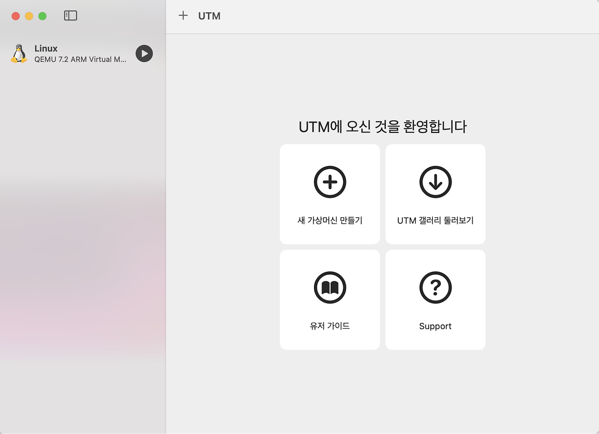
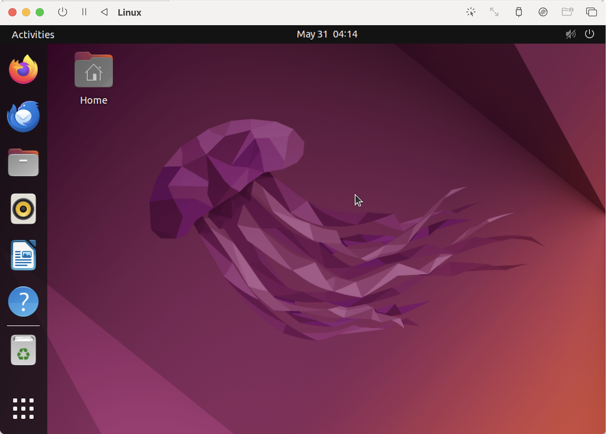

## 리눅스(Linux)

리눅스(Linux)는 오픈 소스 운영체제(Operating System)이다. 1991년 리누즈 토발즈(Linus Torvalds) 가 유닉스(Unix)에 기반하여 만든 운영체제이며, 다양한 기기와 플랫폼에서 사용될 수 있는 안정 적이고 유연한 운영체제이다. 처음 등장한 이후로 오늘날까지 웹 서버, 클라우드 컴퓨팅, 모바일 기기, 임베디드 기기 등 여러 분야에서 사용된다. 다음은 리눅스에 대한 주요 특징이 된다.

> - **오픈 소스 소프트웨어**  
> 	리눅스는 소스 코드가 공개되어 있어 누구나 자유롭게 수정하고 배포할 수 있다. 이는 많은 개발자들이 협력하여 운영체제를 개선하고 발전시킬 수 있게 한다.  
> - **다양한 배포판**  
> 	리눅스는 다양한 배포판(Distribution)으로 제공된다. 대표적인 배포판으로는 우 분투(Ubuntu), 페도라(Fedora), 데비안(Debian), CentOS 등이 있다. 각 배포판은 사용 목적과 필요 에 따라 다양한 기능과 설정을 제공한다.  
> - **보안성과 안정성**  
> 	리눅스는 보안과 안정성이 뛰어나서 서버, 네트워크 장비, 임베디드 시스템 등 다양한 분야에서 널리 사용된다. 시스템 자원을 효율적으로 관리하고, 사용자 권한과 파일 시스템 의 접근 제어가 엄격하게 관리된다.  
> - **커맨드 라인 인터페이스(CLI)**  
> 	리눅스는 강력한 커맨드 라인 인터페이스를 제공한다. 터미널을 통해 다양한 명령어를 사용하여 시스템을 제어할 수 있으며, 이는 자동화 및 스크립트 작성에 매 우 유용하다.  
> - **커뮤니티와 지원**  
> 	리눅스는 전 세계적인 사용자와 개발자 커뮤니티의 지원을 받는다. 다양한 온 라인 포럼, 문서, 튜토리얼이 제공되어 사용자들이 문제를 해결하고 지식을 공유할 수 있다.

---
## Virtual Machine

현재 Windows와 Mac이 가장 널리 사용되는 운영체제이므로, 이러한 시스템에서 리눅스를 사용 하려면 가상 머신(Virtual Machine)을 활용해야 한다. 기존 Mac 환경에서는 Parallels, VMWare Fusion, UTM, VirtualBox 등의 VM을 사용할 수 있었으나, **M1 칩**으로 전환되면서 아키텍처가 intel x86_64에서 **arm64**로 변경되어 일부 VM은 더 이상 사용이 불가능해졌다. VMWare Fusion과 Parallels는 여전히 사용 가능하지만, 가격이 비교적 높아 제외하였고, 무료로 사용할 수 있으며 arm64를 지원하는 UTM을 리눅스 운영체제를 설치하기 위한 VM으로 선택했다.

---
## Ubuntu with UTM

UTM에 Ubuntu 운영체제를 설치하려면 다음 단계를 따라야 한다.

**1. UTM 다운로드 및 설치**  
UTM 공식 웹사이트에서 UTM을 다운로드하여 설치한다.  
  
**2. Ubuntu ISO 이미지 다운로드**  
Ubuntu 공식 웹사이트에서 최신 버전의 Ubuntu ISO 이미지를 다운로드한다.  
  
**3. 새 가상 머신 생성**  
UTM을 실행한 후, 상단의 "+" 버튼을 클릭하여 새 가상 머신을 생성한다.  
"Virtualize"를 선택한 후, "Linux"를 선택한다.  
  
**4. ISO 이미지 선택**  
"Import"를 클릭하여 다운로드한 Ubuntu ISO 이미지를 선택한다.  
  
**5. 시스템 설정**  
"System" 탭에서 원하는 가상 머신의 CPU와 메모리를 설정한다. 기본 설정으로도 충분하지 만, 사용 가능한 자원을 적절히 할당한다.  
  
**6. 스토리지 설정**  
"Drives" 탭에서 "New Drive"를 클릭하여 가상 하드 드라이브를 생성한다. 디스크 크기는 최소 20GB 이상으로 설정하는 것이 좋다.  
  
**7. 네트워크 설정**  
"Network" 탭에서 "Emulated Network"를 선택하여 네트워크 연결을 설정한다.  
  
**8. 가상 머신 시작 및 Ubuntu 설치**  
설정이 완료되면, "Save"를 클릭하고 가상 머신을 시작한다.  
Ubuntu 설치 화면이 나타나면, 화면의 지시에 따라 Ubuntu를 설치한다.  
  
**9. 설치 완료 후 설정**  
설치가 완료되면, 가상 머신을 재부팅하고 Ubuntu를 설정한다. 초기 설정 과정에서 사용자 계정과 기타 기본 설정을 완료한다.

이제 UTM 에서 Ubuntu 운영체제를 사용할 수 있다.

> [!note] 명령어를 사용하다보면 ‘**sudo**’로 시작하는 명령어가 많다. **sudo**의 의미는 무엇일까?
> **sudo 명령어**는 유닉스 및 리눅스 계열에서 다른 사용자의 보안권한과 관련된 프로그램을 구동할 수 있게 해주는 프로그램이다. sudo는 각 command line에 사용할 수 있으며 sudo <command>의 형태로 작성한다. <command>에 적은 shell command는 root 권한으로 수행된다.
