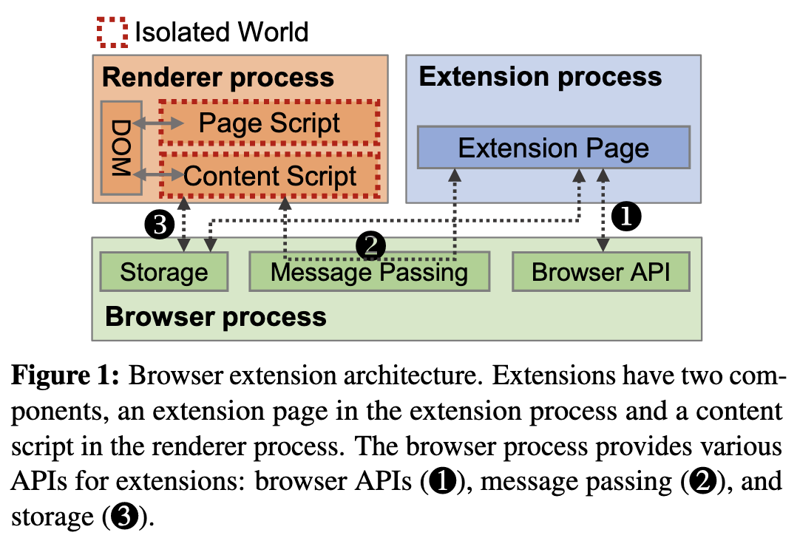
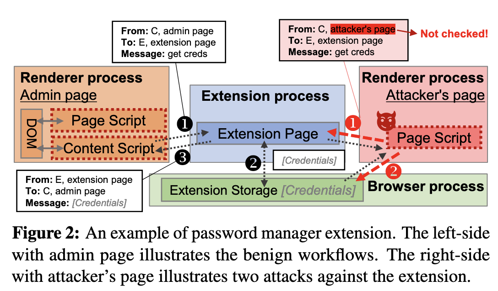
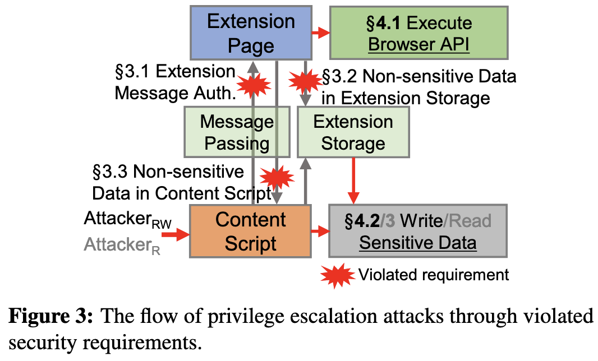
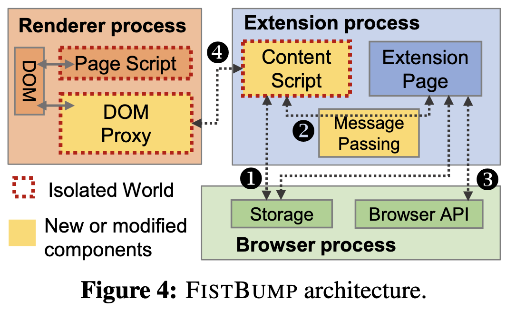
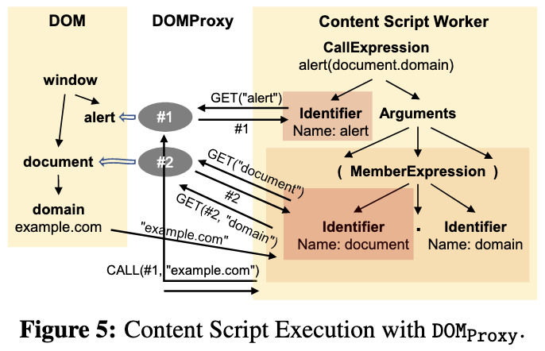
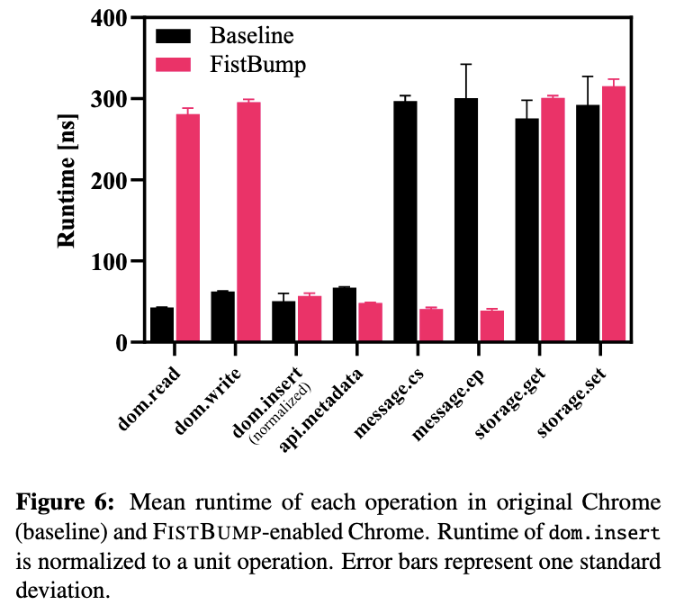

## Abstract

- 브라우저와 공격 타겟
	- 웹 브라우저는 공격자들이 사용자로부터 보안 및 개인정보 데이터를 탈취할 수 있는 매력적인 타겟이다(e.g. 온라인 뱅킹 정보, 소셜 네트워크 자격 증명 etc).
- 브라우저 보안 접근 방식
	- ==최소 권한 원칙(Principle of Least Privilege, **PoLP**)==을 채택하여 브라우저 침해 시 피해를 최소화한다.
	- PoLP 구현 방식:
		1. 멀티프로세스 아키텍처
		2. 사이트 격리(site isolation)
- 브라우저 확장 프로그램에 PoLP 적용
	- PoLP에 따라 확장 프로그램의 두 주요 컴포넌트를 분리한다(높은/낮은 권한).
- 확장 프로그램의 보안 문제
	- 현재 아키텍처에서 보안 요구 사항 충족이 어렵다(40개 익스텐션에서 59개 vulnerabilities 발견).
	- 권한 상승 공격으로 ==**UXSS**==(Universal Cross-Stie Scripting, 웹사이트 관리자가 아닌 이가 웹페이지에 악성 스크립트를 삽입할 수 있는 취약점), 암호 및 암호화폐 탈취가 발생했다.
	- 취약점이 있는 인기 확장 프로그램은 1천만 명 이상의 사용자를 보유한다.
- FISTBUMP 제안
	- PoLP 강화: 웹페이지와 콘텐츠 스크립트 간 강력한 프로세스 격리로 취약점을 제거한다.
	- 하위 호환성: 기존 확장 프로그램의 수정 없이 실행 가능하다.

---
## 1. Introduction

- 브라우저 보안 개요
	- 브라우저는 인터넷과 사용자를 연결하는 주요 공격 대상이며, covid-19 이후 온라인 활동 증가로 더욱 표적이 되었다.
	- 공격자가 악성 사이트로 유도하면 브라우저의 취약점을 악용해 온라인 뱅킹, 소셜 네트워크 계정 등 보안 데이터 탈취가 가능하다.
	- 이에 대응하여 브라우저는 PoLP를 엄격히 적용한다.
- PoLP 기반 브라우저 보안 모델
	- 멀티프로세스 아키텍처:
		- 렌더러 프로세스(원격 콘텐츠 처리)와 브라우저 프로세스(관리 및 사용자 인터페이스)를 분리한다.
		- 렌더러 프로세스는 최소 권한만 부여, 브라우저 프로세스는 시스템 리소스 접근이 가능하다.
	- Site Isolation
		- SOP(Same-Origin Policy)를 프로세스 수준에서 적용한다.
		- 서로 다른 웹사이트는 각각의 렌더러 프로세스에서 실행하여 사이트 간 데이터 접근을 차단한다.
	- 보안 효과
		- PoLP 강화로 인해 렌더러 프로세스만 침해해서는 중요 데이터 탈취가 불가하다.
		- 공격자는 샌드박스를 우회할 추가적인 취약점을 찾아야 한다.
- Extensions 보안 문제
	- 보안 특징
		- 브라우저의 고권한 API(쿠키, 북마크, 방문 기록 등)에 접근이 가능하다.
		- 웹사이트뿐만 아니라 사용자 데이터(e.g. 비밀번호 관리자, 암호화폐 지갑)를 다룬다.
	- PoLP 적용 방식
		- ==Content Script== -> 낮은 권한, 웹페이지와 상호작용
		- ==Extension Page== -> 높은 권한, 브라우저 API 접근 가능
		- 두 컴포넌트 간 메시지 교환을 통해 작업을 수행한다.
- PoLP 적용 실패로 인한 보안 취약점
	- PoLP 적용이 불완전하여 extension이 주요 공격 경로로 악용 가능하다.
	- 주요 보안 요구 사항
		- 확장 컴포넌트 간 통신은 인증이 필요하다.
		- Extensions는 SOP(동일 출처 정책)를 위반하면 안 된다.
	- 실제 취약점 결과
		- 40개 extensions에서 59개 권한 상승 취약점을 발견했다.
		- 공격자는 이를 악용해 UXSS, 비밀번호 및 암호화폐 탈취 수행이 가능하다.
	- 문제의 근본 원인
		- 현재 브라우저 확장 아키텍처는 Security-by-default(보안 기본값)이 아닌 개발자 의존이다.
		- *Extension 개발자는 보안 전문가가 아니므로*, 요구 사항을 충족하지 못하는 경우가 많다.
- 해결책: **FISTBUMP**
	- PoLP 강화를 위해 FISTBUMP라는 새로운 보안 아키텍처를 제안한다.
	- FISTBUMP의 핵심 특징
		1. content script를 웹페이지와 완전히 격리하여 강력한 프로세스 격리를 적용한다.
		2. 보안 요구 사항을 설계 단계에서 충족하여 기존 취약점을 제거한다.
		3. 하위 호환성을 유지하여 기존 extensions는 수정 없이 FISTBUMP에서 실행 가능하다.
		4. 성능 최적화
			- content script와 웹페이지 간 요청을 투명 프록시로 처리.
			- 실행 속도 유지(최대 13%의 실행 시간 오버헤드).

> [!note] 논문의 주요 기여점
> 1. Extension architecture의 보안 문제 분석
> 	- PoLP 미흡으로 인해 렌더러 프로세스가 침해될 경우 확장 프로그램이 주요 공격 경로가 될 수 있음을 규명한다.
> 2. 실제 취약점 발견 및 분석
> 	- Chrome, Firefox, Safari extensions에서 50개의 **권한 상승 취약점을 확인**했다.
> 3. 새로운 보안 아키텍처 FISTBUMP 제안 및 구현
> 	- 강력한 프로세스 격리를 통해 모든 취약점을 제거하는 Security-by-default architecture를 구축한다.

---
## 2. Background


### 2.1 Web Browser Security

**브라우저의 PoLP 적용 및 multi-process architecture**
- 최신 브라우저는 PoLP를 준수하여 여러 개의 프로세스로 분리된다.
- Multi-process architecture
	- Renderer Process
		- 신뢰할 수 없는 웹 콘텐츠를 렌더링하는 **비특권 프로세스**.
		- 직접적인 시스템 호출 불가능, 다른 프로세스 메모리 접근 불가.
	- Browser Process
		- 렌더러 프로세스가 리소스에 접근할 수 있도록 중개 역할을 수행하는 **고권한 프로세스**.
		- 렌더러 프로세스가 통신(IPC)을 관리.
- 보안 효과
	- 렌더러 프로세스가 침해되더라도 브라우저 프로세스 및 다른 렌더러 프로세스는 안전하다.

**Threats against Renderer Processes**
- 일반적으로 렌더러 프로세스는 *샌드박싱되어 있지만*, 다른 사이트가 동일한 렌더러 프로세스에서 실행될 수 있다.
- 공격 유형
	1. AttackerRW (메모리 읽기/쓰기 가능): 렌더러 프로세스의 메모리 취약점(e.g. 메모리 손상 버그)을 악용하여 임의 코드 실행이 가능하고 UXSS 공격을 수행한다.
	2. AttackerR (메모리 읽기 가능): Meltdown, Spectre 같은 CPU 트랜지언트 실행 취약점을 악용하여 웹사이트 간 데이터 유출이 가능하다.

**Site Isolation 적용**
- Chrome과 Firefox는 사이트 격리(site isolation, fission)를 통해 각 사이트를 별도의 렌더러 프로세스에서 실행하도록 개선한다.
	- e.g. `example.org` 가 `example.com` 내에서 임베드되었을 경우, 각각 다른 프로세스에서 실행된다.
	- 교차 사이트 데이터 요청을 차단하여 SOP 위반을 방지한다.
- 보안 효과
	- AttackerRW 및 AttackerR의 공격 범위를 제한하여 SOP 위반 및 UXSS 공격을 차단한다.
	- 2022년 기준, Chrome에서 UXSS 취약점 0건, 샌드박스 우회 취약점 8건(이 중 4건은 악성 익스텐션 필요).


### 2.2 Browser Extension Architecture

**확장 프로그램 개요**
- 익스텐션은 사용자가 설치하여 기능을 확장하는 서드파티 프로그램이다.
- 주요 API
	- Chrome 및 Chromium 기반 브라우저(Edge, Opera, Brave), Firefox, Safari는 Chrome Extensions API 또는 WebExtensions API를 사용한다.
	- ActiveX, NPAPI, PPAPI 등 기존 플러그인 인터페이스는 폐기되었다.

**PoLP 적용 방식**
- Permission-based Access Control
	- 익스텐션은 설치 시 필요한 권한을 `manifest.json` 에 선언한다.
	- e.g. 방문 기록, 쿠키, 북마크, 특정 웹사이트에서의 활성화 권한 등.
	- *설치 후 권한을 추가할 수 없으므로*, 익스텐션의 피해 범위가 제한된다.
- 익스텐션의 구성 요소 분리
	1. Extension Page: 독립된 프로세스에서 실행, 브라우저 API 접근 가능.
	2. 저권한 Content Script: 렌더러 프로세스에 주입되어 웹페이지와 직접 상호작용.



**Extensions Pages**
- 브라우저 API에 접근 가능하며, 모든 출처(Origin)로 `HTTP request` 가 가능하다(단, 사전에 권한을 선언).
- 별도의 프로세스에서 실행하여 일반 웹사이트 및 다른 확장 프로그램과 격리된다.
- 익스텐션은 고유한 ID(`IDEXT`)를 가지며, 사이트 격리 및 SOP가 적용된다.
- 백그라운드에서 실행되며 메시지 수신, 탭 열기, 네트워크 요청 감시 등의 역할을 수행한다.

**Content Script**
- 웹페이지와 직접 상호작용하는 **비특권 컴포넌트**이다.
- 웹페이지가 로드될 때 삽입되어 DOM 수정이 가능하다.
- 동일한 렌더러 프로세스에서 실행되므로 보안 위험이 높아 브라우저 API 접근 불가, 확장 페이지와 메시지 교환을 통해 작업을 수행한다.
- 사이트 격리를 적용하여 SOP 준수, 크로스 사이트 요청이 불가하다.
- 격리된 실행 환경(Isolated World) 적용
	- 자체 JavaScript 힙과 DOM 래퍼를 가져 웹페이지 스크립트와 직접적으로 변수를 공유할 수 없다.
	- e.g. `document.foo` 를 콘텐츠 스크립트에서 정의해도 웹페이지에서는 보이지 않는다(반대의 경우도 동일).

**확장 프로그램 메시징 시스템 (Extension Message)**
- 확장 페이지 콘텐츠 스크립트가 message passing을 통해 통신한다.
- 메시지 구성 요소
	1. Sender: `IDEXT`, `URL`, Origin 정보 포함.
	2. Recipient: 대상 컴포넌트 및 `IDEXT` 포함.
	3. Payload: `JSON` 형식으로 직렬화하여 전송.
- 메시지는 브라우저 프로세를 통해 IPC로 전달된다.

**Extension Storage**
- 익스텐션 영구 저장소를 지원하여 브라우저 재시작 후에도 데이터를 유지할 수 있다.
- 저장소는 브라우저 프로세스 내에 존재하며, 익스텐션별로 분리되어 다른 확장 프로그램의 저장소 접근이 불가하다.
- 확장 페이지 및 콘텐츠 스크립트가 브라우저 프로세스를 통해 요청하여 저장소 접근이 가능하다.

**Example: Password Manager Extension**
1. 사용자가 로그인 페이지에 접근하면 확장 프로그램이 사용자 로그인 정보를 저장한다.
2. 이후 로그인 페이지 방문 시 자동으로 credential(자격 증명)을 입력한다.
3. 확장 프로그램은 별도의 관리 페이지를 제공하여 사용자가 저장된 비밀번호를 확인할 수 있다.
4. 메시지 전달 방식
	- 콘텐츠 스크립트(C)가 관리 페이지에 삽입하여 저장된 자격 증명을 요청한다.
	- 확장 페이지(E)가 요청을 받아 브라우저 프로세스에서 데이터를 가져온다.
	- 데이터를 콘텐츠 스크립트(C)에 전달하여 화면에 표시한다.




---
## 3. Security Requirements to Protect Against Renderer Attackers

- 렌더링 엔진의 복잡성 증가로 취약점이 증가하며, 브라우저는 사이트 격리 등의 방어 기법을 도입하여 렌더러 공격자의 권한을 제한한다.
- 그 결과, *익스텐션의 보안이 주요 방어선이 되었다.*
- PoLP 원칙에 따르면, Content Script는 낮은 권한을 가지므로 침해되더라도 추가적인 권한을 얻을 수 없어서 한다.
- 하지만, 확장 프로그램 개발자가 특정 보안 요구 사항을 지키지 않으면 PoLP가 무력화되어 권한 상승 공격이 발생한다.
- 많은 확장 프로그램 개발자가 보안 전문가가 아니며, 보안 요구 사항을 준수할 동기가 부족하다.


### 3.1 Extension Message Authentication

- 공격 방식
	- Content Script는 확장 페이지(고권한 컴포넌트)로 메시지를 보내 특정 작업을 요청할 수 있다.
	- *AttackerRW(메모리 읽기/쓰기 가능 공격자)* 는 IPC 메시지를 위조하여 권한 상승이 가능하다.
- **==보안 요구 사항 1==**: 확장 페이지는 Content Script가 합법적인 발신자인지 인증해야 한다.
- 보안 취약점 사례
	1. 개발자가 AttackerRW 모델을 고려하지 않아 발신자를 인증하지 않는다.
	2. 잘못된 인증 방식을 사용한다.
		- URL 기반 인증 오류: `about:blank`, `data:`, `blob:` 등의 특수 URL을 적절히 처리하지 못한다.
		- TOCTOU(시간 확인-사용 시점 경쟁 조건) 공격(e.g. A 사이트에서 실행 요청 -> 실행 직전 B 사이트로 변경 -> B에서 실행)
		- 보안 강화 기능 부족: `isTrusted` 같은 인증 기능이 제공되지 않는다.

```
// Vulnerable extension's background page
chrome.runtime.onMessage.addListener((message, sender, send) => {
	// Improperly authenticates the URL
	if (sender.url.startsWith("https://admin.com")
		&& message == "getCredentials")
		sendResponse(credentials);
7 });
// AttackerRW on https://admin.com.attacker.com
chrome.runtime.sendMessage("getCredentials")	
```
**Listing 1**: 보안 취약점이 있는 코드 패턴과 이를 악용할 수 있는 PoC 공격 예제.

- 실제 공격 예시 (비밀번호 관리자 확장 프로그램)
	- 공격자가 `https://admin.com.attacker.com` 도메인을 등록하여 관리 페이지처럼 위장하고 인증 우회 후 비밀번호를 탈취한다.


### 3.2 Non-sensitive Data in Extension Storage

- 공격 방식
	- Content Script가 실행되는 렌더러 프로세스는 Extension Storage에 접근 가능하다.
	- AttackerRW가 침해한 경우 저장소의 데이터를 읽거나 수정 가능하다.
- **==보안 요구 사항 2==**: 익스텐션 저장소에는 보안이 중요한 데이터(password, 개인 정보, 크로스 사이트 데이터, etc)를 저장해서는 안 된다.
- 보안 취약점 사례: 많은 개발자들이 익스텐션 저장소가 안전하다고 착각하여 민감한 데이터를 저장한다.

```
// Vulnerable extensions's backgorund page
// Stores credentials on the extension storage
chrome.storage.set("credentials", credentials);

// AttackerRW on any page
chrome.storage.get("credentials")
```
**Listing 2**: 보안 취약점이 있는 코드 패턴과 이를 악용할 수 있는 PoC 공격 예제.

- 실제 공격 예시 (비밀번호 관리자 익스텐션)
	- 익스텐션 저장소에 자격 증명 저장 -> AttackerRW가 저장된 비밀번호를 불법적으로 읽어온다.


### 3.3 Non-sensitive Data in Content Script

- 공격 방식
	- Content Script는 렌더러 프로세스에서 실행되므로 AttackerR(메모리 읽기 공격자) 및 AttackerRW가 읽을 수 없다.
	- 특히 AttackerR은 브라우저 취약점 없이도 CPU 사이드 채널 공격(Meltdown, Spectre)으로 데이터에 접근한다.
	- 고해상도 타이머(high-granularity timer)를 활용한 공격이 가능하므로 Chrome 및 Firefox는 이를 제한했으나, Content Script 주입에는 영향을 주지 않았다.
- **==보안 요구 사항 3==**: Content Script에는 보안이 중요한 데이터(password, 개인 정보, etc)를 로드해서는 안 된다.

```
// Vulnerable extension's background page
// Send sensitive data to the content script
chrome.tabs.sendMessage(tabId, sensitiveData);

// The message is enqueued in the renderer process's message queue,
// so AttackerR can read the message
readMemory();
```
**Listing 3**: 보안 취약점이 있는 코드 패턴과 이를 악용할 수 있는 PoC 공격 예제.

- 보안 취약점 사례: 개발자들은 Content Script 내부 데이터가 외부에 노출되지 않는다고 착각하고 민감한 데이터를 저장한다.
- 실제 공격 예시
	- Background Page에서 Content Script로 민감한 데이터 전송 -> AttackerR이 메모리에서 해당 데이터를 읽는다.

---
## 4. Privilege Escalation Attacks via Extensions

- 익스텐션의 보안 요구 사항을 검토한 결과, 많은 익스텐션이 이를 준수하지 않아 권한 상승 공격을 가능하게 한다.
- 3가지 주요 공격 기법을 개발하여 동일 출처 정책(SOP)을 우회하고, 다른 사이트에서 스크립트를 실행하는 UXSS 공격 수행이 가능하다.
- UXSS 공격을 통해 공격자는 피해자의 이메일을 읽거나, 은행 이체 등 피해자를 대신하여 조작한다.


### 4.1 Execute Privileged Browser APIs

- 브라우저 API는 다른 사이트의 데이터를 읽거나 브라우저 동작을 변경할 수 있으므로, 이를 호출하는 확장 메시지는 인증이 필요하다(==보안 요구 사항 1==).
- 그러나 23개의 익스텐션이 이 요구 사항을 지키지 않아 공격자가 고권한 API를 무제한 실행 가능하다.


👉🏻 **_Case Studies_**

1. **Honey**
	- `executeScript` API에 대한 제한이 없어, 임의의 Javascript를 탭에서 실행하게 하여 UXSS 공격이 가능하다.
	- 모든 탭 이벤트를 Content Script로 브로드캐스트하여 탭 정보가 노출된다.

2. **Tampermonkey**
	- `fetch`, `tabs`, `cookies` API를 자유롭게 호출 가능하여 SOP 우회 및 크로스 사이트 데이터 읽기가 가능하다.

3. **ClassLink OneClick Extension**
	- `executeScript` API가 탭 ID를 기반으로 실행되므로, 페이지 이동 후에도 동일한 ID를 유지한다.
	- 공격자가 페이지 언로드(unload) 이벤트를 이용하여 다른 사이트에서 스크립트 실행이 가능하여 UXSS가 발생한다.

4. **Opera Component Extensions**
	- `settingsPrivate` API가 Content Script에서 접근 가능하여 브라우저 설정을 변경할 수 있다.
	- DNS/Proxy 설정 변경을 통한 MITM 공격이 가능하다.
	- 샌드박스 탈출 또는 UXSS 공격을 수행한다.


### 4.2 Write Sensitive Extension Data

- Extension Page는 Content Script보다 높은 권한을 가지므로, 페이지의 설정을 Content Script에서 변경할 수 없어야 한다.
- 그러나 많은 익스텐션이 이를 허용하여 공격자가 확장 기능을 악용할 수 있게 한다.
- 특히, 익스텐션이 주입하는 스크립트의 설정을 변경할 경우 UXSS 공격이 가능하다.


👉🏻 **_Case Studies_**

1. **Ad Blockers** (광고 차단기 익스텐션)
	- 사용자가 필터 규칙을 추가할 수 있으며, 일부 규칙은 사이트에 스크립트를 삽입하여 광고를 제거한다.
	- e.g. `example.com#$#alert(document.domain)`->`example.com` 에서 `alert(document.domain` 실행.
	- 공격자가 사용자 요청을 위조하여 악성 필터를 추가하면, 임의 코드를 실행할 수 있다.
	- 6개의 광고 차단 익스텐션이 이러한 설정을 Extension Storage에 저장하여 공격자가 변경 가능하다.

2. **Tampermonkey**
	- 사용자가 특정 페이지에서 실행할 Userscript를 추가할 수 있다.
	- 공격자가 요청을 위조하여 악성 Userscript를 추가하면, 원하는 웹사이트에서 악성 코드 실행이 가능하다.
	- Tampermonkey는 Userscript를 Extension Storage에 저장하여, 공격자가 직접 수정할 수 있게 한다.
	- Userscript가 확장 API를 호출할 수도 잇어, 공격자가 API 요청을 위조할 수 있게 한다.

3. **Google Translate**
	- 페이지 번역을 위해 페이지에 스크립트를 삽입한다.
	- 사용자는 번역할 언어를 선택 가능하며, 이 설정이 Extension Storage에 저장된다.
	- 공격자가 설정값을 스크립트 코드로 변경하면, 번역된 페이지에서 XSS가 발생할 수 있다.


### 4.3 Read Sensitive Extension Data

- 익스텐션이 민감한 데이터를 안전하게 저장하고 접근을 제한해야 한다.
- 그러나 19개의 익스텐션이 보안 요구 사항을 충족하지 않아 공격자가 민감한 데이터를 훔칠 수 있다.


👉🏻 **_Case Studies_**

1. **Windows Account and Office**
	- Windows 및 Azure Active Directory(AAD) 계정 로그인을 지원한다.
	- 로그인 시 Content Script가 OS에서 토큰을 가져오도록 요청한다.
	- 공격자가 로그인 페이지 URL을 위조하면, 계정을 탈취할 수 있다.

2. **Password Managers** (비밀번호 관리자)
	- 저장된 웹사이트 로그인 정보를 제공한다.
	- 로그인 페이지 방문 시, Content Script가 Extension Page에 저장된 비밀번호를 요청한다.
	- LastPass 및 Bitwarden에서는 공격자가 사이트 URL을 위조하여 해당 사이트의 비밀번호 탈취가 가능하다.
	- 6개의 비밀번호 관리자를 추가 분석한 결과, 모든 익스텐션에서 비밀번호 탈취 가능하다.
	- 4개의 익스텐션은 암호화 키도 Extensions Storage에 저장하여 공격자가 접근 가능하다.

3. **Cryptocurrency Wallets** (암호화폐 지갑)
	- 트랜잭션 서명을 위한 private key를 저장한다.
	- 사용자가 트랜잭션 서명을 요청하면, Content Script가 요청을 Background page로 전달한다.
	- Background page가 사용자에게 확인 요청 후, 트랜잭션을 서명하여 반환한다.
	- MetaMask에서는 공격자가 서명 확인 메시지를 위조하여 악성 트랜잭션을 승인 가능하게 한다.
	- MetaMask는 트랜잭션 큐를 Extension Storage에 저장하여, 공격자가 임의의 트랜잭션 추가를 가능하게 한다.
	- 추가 분석 결과, 7개의 암호화폐 지갑 중 4개에서 공격자가 임의의 트랜잭션 서명을 가능하게 한다.
	- Phantom, TronLink, Kaikas에서는 공격자가 요청을 위조하여 복구용 니모닉 및 개인 키 탈취를 가능하게 한다.



---
## 5. Design of FISTBUMP

- 현재 익스텐션 아키텍처는 렌더러 공격자(AttackerRW, AttackerR)에 의해 Content Script가 공격당한 가능성이 있다.
- 기존 아키텍처는 확장 페이지와 Content Script 간의 권한을 올바르게 분리하는 것이 어렵고, 보안 요구 사항이 자주 위반되어 권한 상승 공격이 발생한다.
- FISTBUMP는 Content Script를 강력한 프로세스 격리를 통해 보호하는 새로운 익스텐션 아키텍처이다.


- **FISTBUMP의 핵심 원리**
	1. Content Script를 렌더러 프로세스에서 제거하여 확장 프로세스에서 실행한다.
	2. Content Script 실행 프로세스를 보호 영역(protection domain)으로 활용하여 공격자가 Content Script 권한 탈취가 불가능하도록 한다.
		- 공격자가 확장 메시지를 위조하거나, 확장 저장소를 접근하는 것이 원천적으로 차단된다.
	3. 설계 자체에서 보안 요구 사항을 충족하여 취약점을 제거한다.
	4. 보안 유지 책임을 확장 개발자가 아닌 브라우저와 OS가 담당하도록 전환한다.


**Design Overview**
1. Content Script의 강력한 프로세스 격리 적용
2. DOMProxy를 활용한 기능 및 호환성 유지
3. DOMProxy 성능 최적화


### 5.1 Strong Process Isolation for Content Script

**<설계 목표 1>**
Content Script를 렌더러 프로세스로부터 강력하게 격리
- 기존 익스텐션 아키텍처에서는 Content Script가 렌더러 프로세스에서 실행되어, AttackerRW 및 AttackerR이 Content Script를 직접 조작 가능하다.
- FISTBUMP는 Content Script를 확장 프로세스로 이동하여 프로세스 격리를 강화한다.
	- 확장 페이지가 실행되는 프로세스에서 Content Script를 전용 워커(worker) 스레드로 실행한다.
	- Content Script는 여전히 제한된 권한을 가지며, 실행 환경(Isolated World)에서 보호된다.
	- CSP(Content Security Policy)를 적용하여 원격 코드 실행을 방지한다.
- 보안 효과
	- Content Script가 더 이상 렌더러 프로세스에 존재하지 않으므로 AttackerR 및 AttackerRW가 Content Script를 조작할 수 없다.
	- 렌더러 프로세스는 Content Script의 확장 메시지 전송 및 저장소 접근 권한을 잃어, PoLP를 준수하게 된다.


### 5.2 Transparent Isolation with DOM Proxy

**<설계 목표 2>**
기존 익스텐션과의 호환성을 유지하면서 투명한 격리 제공
- 격리를 강화하면 기존 아키텍처가 변경될 가능성이 높아, FISTBUMP는 최소한의 변경으로 호환성을 유지한다.
- 문제점
	- 기존 브라우저 아키텍처에서는 Content Script, DOM, 페이지 스크립트가 같은 렌더러 프로세스에서 실행되어 직접 DOM 접근이 가능하다.
	- 그러나 FISTBUMP에서는 Content Script가 확장 프로세스로 이동하여 렌더러 프로세스의 DOM에 직접 접근이 불가하다.



- 해결책: DOMProxy 도입
	- Content Script가 직접 DOM에 접근하는 대신, DOMProxy가 요청을 중계한다.
	- IPC(Message Passing)를 통해 Content Script 워커와 DOMProxy가 DOM 연산을 주고받는다.
	- Content Script가 DOM 객체를 참조할 경우:
		1. DOMProxy가 참조 객체를 생성하고 ID를 반환한다.
		2. Content Script 워커는 해당 ID를 이용해 가상 객체(Delegate Object)를 생성한다.
        3. 모든 DOM 연산은 DOMProxy를 통해 수행된다.
    - DOM 이벤트 리스너 등록도 프록시 방식으로 구현
        1. Content Script에서 이벤트 리스너를 등록하면, DOMProxy가 대응하는 이벤트 리스너를 렌더러 프로세스에 등록한다.
        2. 이벤트가 발생하면 DOMProxy가 콘텐츠 스크립트 워커로 전달한다.
        3. Content Script 워커가 이벤트를 클론하여 최종적으로 전달한다.


👉🏻 ***실제 예제: `alert(document.domain)` 실행 과정****

1. Content Script가 `alert` 호출 → GET("alert") 요청을 DOMProxy로 전달한다.
2. DOMProxy가 `alert` 함수에 대한 참조(REFalert)를 생성하여 반환한다.
3. Content Script가 `document` 객체 접근 → GET("document") 요청 전달 → REFdocument 반환한다.
4. Content Script가 `document.domain` 접근 → GET(REFdocument, "domain") 요청을 전달한다.
5. DOMProxy가 `document.domain` 값을 읽어 `example.com`을 반환한다.
6. Content Script가 `alert("example.com")` 실행 요청 전달 → DOMProxy가 최종 실행한다.

**확장 API 호출 최적화**

- 기존 브라우저 아키텍처에서는 확장 API 호출 시 IPC를 사용 → 프로세스 간 메시지 전달이 필요하다.
- FISTBUMP는 Content Script와 확장 페이지가 같은 프로세스에서 실행 → IPC가 필요 없다.
- Content Script에서 API를 호출하면, Content Script 워커가 직접 확장 페이지로 전달 → 성능을 향상한다.


### 5.3 Optimizing Performance of DOM Proxy

**<설계 목표 3>**
격리를 유지하면서 성능 오버헤드를 최소화
- DOMProxy는 모든 DOM 접근을 중계하기 때문에, 성능 저하가 발생할 가능성이 있다.
- FISTBUMP는 메모리 관리, 배치 처리, 캐시를 활용하여 성능을 최적화한다.

1. 메모리 관리 (Memory Management)
- 문제점: DOMProxy가 생성한 참조 객체가 Content Script에서 더 이상 사용되지 않더라도, 남아 있을 경우 Memory leak 발생이 가능하다.
- 해결책: Content Script 워커에서 delegate 객체가 가비지 컬렉션(GC)되면, DOMProxy에서도 참조 객체를 자동 삭제한다.

2. 배치 처리 및 캐시 (Batch Processing and Cache)
- 문제점: 각 DOM 연산마다 개별 IPC 요청이 발생하면 성능이 저하된다.
- 해결책
    - 작용이 없는 DOM 연산들을 큐에 저장하고 배치 처리(batch processing)하여 IPC 호출 횟수를 줄인다.
    - 가상 DOM을 유지하여 독립적인 DOM 조작은 콘텐츠 스크립트 내에서 수행한다.
    - 불변(immutable) 속성 또는 검증이 쉬운 속성을 캐싱하여 성능을 최적화한다.

---
## 6. Implementation

**개발 환경 및 구성 요소**
- FISTBUMP는 Chromium 105 기반으로 구현되었다.
- 두 가지 주요 구성 요소로 이루어졌다.
	1. Extension Wrapper -> Javascript (3,000+ LoC)
		- 확장 API를 기반으로 구현했다.
		- DOMProxy는 Content Script로 구현했다.
		- Content Script 워커는 Background Page에서 실행한다.
		- 확장 메시징을 통해 서로 통신한다.
	2. Chromium 브라우저 수정 (Browser-Side Modification) -> C++ (100 LoC)
		- 브라우저 수준에서 소규모 변경을 적용한다.

**호환성 및 확장 가능성**
- 표준 Web API 및 JavaScript(ECMAScript) 기능을 사용하여 구현되어, 최신 Firefox 및 Safari에서도 호환이 가능하다.
- 기존 익스텐션에 쉽게 적용 가능하다 (단, `document_start` 을 사용하는 Content Script는 브라우저 측 수정 필요).
- 브라우저 측 변경이 적으므로, 다른 브라우저에서도 유사한 방식으로 적용 가능하다.

---
## 7. Evaluation

- 실험 환경
	- CPU: Intel i7-10700K, RAM: 32GB
	- Chromium 버전: 101.0.4951.41
	- 비교 대상: FISTBUMP 적용 브라우저 vs 기존 브라우저
	- 테스트 도구: DOM Fuzzer (Domato) 사용


### 7.1 Security

✅ FISTBUMP는 기존 익스텐션 보안 요구사항을 설계적으로 충족한다.
- 메시지 인증(보안 요구 사항 1) 충족
	- 렌더러 프로세스는 더 이상 Content Script를 실행하지 않으므로, 공격자가 확장 메시지를 위조할 수 없다.
	- 모든 메시지는 신뢰할 수 있는 프로세스에서만 송신되어 인증이 필요 없다.
- 저장소 보호(보안 요구 사항 2) 충족
	- 렌더러 프로세스에서 Extension storage 접근이 원천 차단된다.
	- 공격자가 저장소의 데이터를 수정하거나 탈취할 수 없다.
- Content Script 메모리 보호(보안 요구 사항 3) 충족
	- Content Script가 확장 프로세스에서 실행되므로, 렌더러 프로세스에서 메모리를 읽을 수 없다.
	- AttackerR 및 AttackerRW가 Content Script 데이터를 탈취할 수 없다.


**추가적인 공격 표면 분석**
✅ FISTBUMP는 DOMProxy를 통한 추가적인 공격 표면을 방지하도록 설계되었다.
- AttackerRW가 DOMProxy 메시지를 위조할 가능성이 있어, 메시지는 기존 메시징 방식을 따르며, 순수한 구조화된 데이터만 교환하므로 안전하다.
- Content Script 워커는 원격 코드 실행을 방지하도록 CSP를 적용한다.
- 공격자가 FISTBUMP를 우회하려면, Content Script 내에서 임의 코드 실행 및 CSP 우회 취약점을 발견해야 하고, 메모리 손상 취약점과 함께 활용할 수 있는 코드 가젯이 존재해야 한다.
- 그러나 2022년에는 CSP 취약점이 보고되지 않았으며, 기존 메모리 손상 취약점은 특수한 사용자 입력이 필요하다. 따라서 FISTBUMP를 통해 공격자가 새로운 보안 취약점을 찾는 것이 매우 어렵다.


**익스플로잇 재현 실험**
✅ FISTBUMP가 권한 상승 공격을 방어하는지 검증한다.
- CVE-2022-1134 (Type Confusion RCE) 기반 공격을 실행한다.
- 기존 브라우저에서는 성공했으나, FISTBUMP 환경에서는 모든 공격이 차단된다. FISTBUMP가 예상대로 보안 요구 사항을 충족하고 공격을 차단했다.



### 7.2 Backward Compatibility

✅ FISTBUMP는 기존 익스텐션과의 호환성을 유지한다.
- Chromium 유닛 테스트(75개 API 테스트)를 수행하여 모든 테스트가 통과했다. 이는 Content Script API가 올바르게 동작하며, 기존 익스텐션과 호환됨을 검증한다.

**Limitation**
- JavaScript 이벤트 루프와 DOMProxy 간의 메시지 처리 방식 차이
	- 기존: JavaScript 이벤트 루프는 각 메시지를 순차적으로 실행한다(한 메시지가 실행 완료되기 전가지 다른 메시지 실행 불가).
	- FISTBUMP: DOMProxy를 통한 메시지는 별도로 처리되어 이벤트 핸들러가 코드 실행 중간에 개입 가능하다.
	- 테스트 결과, 기존 익스텐션의 동작에는 영향이 없었다.
	- 일관성 보장을 위해 DOMProxy를 동기적(Synchronous)으로 구현할 수도 있다.


### 7.3 Performance

**DOM 조작 및 확장 API 호출 성능**
✅ FISTBUMP는 IPC로 인한 성능 저하가 존재하지만, 배치 처리 및 최적화를 통해 일부 개선했다.

| 측정 항목                          | 기존 브라우저 | FISTBUMP 적용 브라우저 | 성능 변화                                 |
| ------------------------------ | ------- | ---------------- | ------------------------------------- |
| 단일 DOM 연산<br>(dom.read/write)  | 0 ns    | 235 ns           | IPC 오버헤드 발생                           |
| DOM 요소 삽입<br>(dom.insert)      | 0 ns    | 7 ns             | 배치 처리로 13% 감소                         |
| 확장 API 호출<br>(api.metadata)    | 0 ns    | 28% 성능 향상        | IPC 제거 효과                             |
| 확장 메시징<br>(message.cs/ep)      | 0 ns    | 87% 성능 향상        | 확장 프로세스 내에서 직접 처리                     |
| 확장 저장소 접근<br>(storage.get/set) | 0 ns    | 9% 성능 저하         | Content Script가 Background Page 경유 필요 |

**메모리 사용량 분석**
✅ FISTBUMP 적용 시 약 3.4MB의 추가 메모리 사용이 발생한다.
- DOMProxy 및 Content Script 워커가 3.4MB의 추가 메모리를 사용한다.
- 각 Delegate Object 및 참조 생성 시 1.2KB 추가 메모리를 사용한다.
- Chrome DevTools로 확인한 결과, 사용되지 않는 Delegate Object는 정상적으로 Garbage Collection된다. -> Memory leak이 발생하지 않는다.

---
## 8. Discussion


1. 브라우저 자체의 보안 취약점 발견
	- Chrome, Firefox, Safari에서 AttackerRW가 확장 메시지를 위조하거나 저장소에 접근 가능한 취약점을 발견했다.
	- Chrome과 Safari는 일부 패치가 완료되었지만, Firefox는 취약점을 확인했지만 아직 수정되지 않았다.

2. 보안 취약점 공개 및 벤더 대응
	- 대부분은 익스텐션 개발자는 취약점을 수정하지 않기 때문에, Chrome Web Store에 취약점을 보고하여 관리자가 조치하도록 유도한다.
	- Chromium 팀은 차기 확장 API에서 보안 강화를 논의 중이지만, *FISTBUMP보다 제한적* 이다.

3. 익스텐션 대규모 분석 필요
	- 18,432개(약 15%)의 익스텐션이 모든 페이지에 Content Script를 삽입하고, 메시징/저장소 API를 사용한다.
		- 자동 분석이 어렵지만, ==향후 연구를 통해 추가 취약점을 발견할 가능성이 크다.==

4. FISTBUMP 우회 공격 가능성
	- FISTBUMP는 브라우저 및 OS의 프로세스 격리에 의존하여 커널 공격에는 취약할 수 있다.
	- 하드웨어 및 OS 수준의 보안 조치와 함께 사용해야 한다.

5. FISTBUMP 성능 최적화 방안
	- DOMProxy가 JavaScript 엔진 및 렌더링 엔진과 연동되면 성능 향상이 가능하다.
	- 브라우저 수준에서 DOMProxy 최적화를 지원하면 효과적일 것이다.

---
## 9. Related Work

1. 익스텐션 보안 연구 방향
	- 악성 익스텐션 차단, 취약한 익스텐션을 악용하는 웹페이지로부터 보호.
	- 두 목표는 별개지만, 악성 익스텐션을 제한하면 취약한 익스텐션도 보호할 수 있으므로, FISTBUMP의 접근 방식과 유사하다.

2. 기존 익스텐션 보안 연구
	- 초기 연구들은 샌드박스, 권한 분리, 실행 모니터링 등을 활용하여 보안을 강화했다.
	- PoLP에 기반한 Chrome 확장 모델이 등장했지만, 여전히 많은 확장이 과도한 권한을 요청한다.
	- 기존 연구들은 메시지 인터페이스 보안에 집중했지만, 렌더러 공격자(AttackerRW, AttackerR)에 대한 연구는 부족했다.
	- ==FISTBUMP는 Extension Storage(2014년 도입)의 보안성을 최초로 종합 분석하였다.==

3. 익스텐션 핑거프린팅 연구
	- 공격자가 익스텐션 설치 여부를 탐지하면 맞춤형 공격이 가능하다.
	- 웹 접근 리소스(WAR), DOM 변경 사항, 통신 패턴 분석 등으로 특정 익스텐션을 감지할 수 있다.
	- FISTBUMP 적용 익스텐션도 핑거프린팅 공격에 취약할 가능성이 있어, 추가 연구가 필요하다.

4. PoLP의 중요성
	- 웹 브라우저는 운영체제와 유사한 구조이기 때문에, 익스텐션을 특권 애플리케이션으로 간주해야 한다.
	- FISTBUMP는 PoLP 원칙을 효과적으로 적용하는 새로운 익스텐션 보안 모델을 제안한다.


✅ 핵심 결론: 기존 연구는 PoLP 기반 보안을 강조했지만, 현실적으로 잘 지켜지지 않는다.
✅ FISTBUMP는 기존 연구의 한계를 해결하고, 확장 프로그램 보안을 아키텍처 차원에서 강화한다.

📌 **추가 검토 사항:**
- FISTBUMP가 기존 Manifest V3보다 효과적인지 비교 연구가 필요하다.
- 브라우저 벤더가 FISTBUMP를 채택할 가능성을 분석한다.
- 확장 프로그램 핑거프린팅 방어 기법 연구가 필요하다.

---
## 10. Conclusion

- 현재 익스텐션 아키텍처는 개발자에게 높은 보안 요구 사항을 부과하지만, 현실적으로 지키기 어렵다.
- 인기 익스텐션 40개를 분석한 결과, 총 59개의 보안 취약점을 발견했고, PoLP 원칙이 제대로 적용되지 않았다.
- FISTBUMP는 이러한 취약점을 근본적으로 제거하는 새로운 익스텐션 아키텍처를 제안한다.